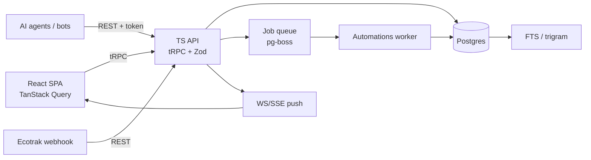
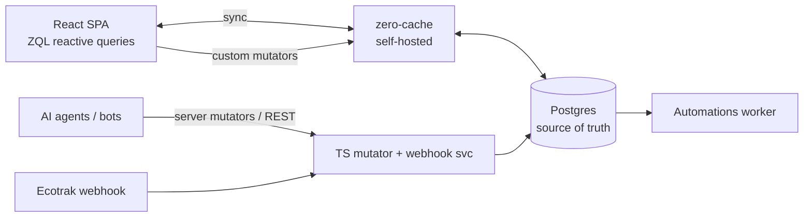
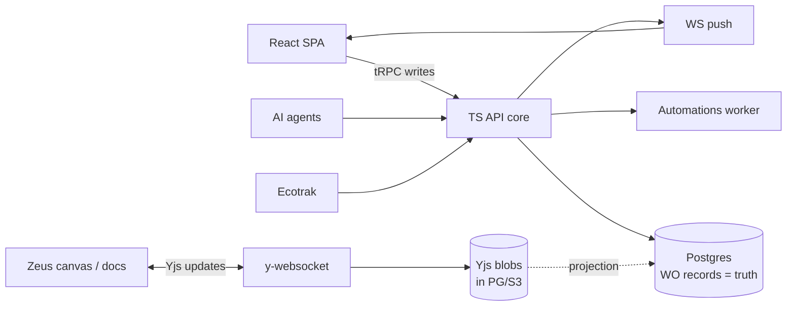

# SeamlessFM Platform — Architecture Proposal

**Author:** Architecture agent · **Date:** 2026-07-23 · **Status:** Draft for Jordan

Goal: choose the backend/data architecture for a **vertical field-service work-order (WO) platform** that replaces the team's ClickUp usage, later exposes its data to the Zeus infinite canvas, and treats AI agents as first-class actors.

## 0. What the real workspace forces (grounding facts)

These are measured from the live ClickUp workspace (read-only map, 2026-07-23), and they reshape the requirements from the generic prompt.

| Fact | Architectural consequence |
|---|---|
| **~98 members** (1 owner, 8 admin, 84 member, 5 guest), 3 brands | Design for **~100 users + client guests**, real ACL/roles, not 5-30. |
| **~21,239 tasks** now; archive list alone = **17,770**; tens of thousands/yr growth | Postgres-scale, but **views/dashboards must aggregate 20K-100K+ rows fast** (indexes, not client scans). |
| **Flat WO model** — 1 task = 1 work order, **0 subtasks**, **0 dependencies** in real use | Subtasks/dependencies = **schema-latent, not MVP**. Don't build reschedule-cascade now. |
| **~100 custom fields/list, 13 types**, incl. **formula** (SLA/aging/profit), currency, location, users, attachment | The **custom-field + formula engine IS the product**. First-class in every candidate. |
| **19-status pipeline**, inherited space→list, `override_statuses=false` everywhere; **status groups** (open/active/done/closed) drive everything | Status set is **container-scoped with inheritance**; group semantics are load-bearing for filters/rollups. |
| **Lists = routing buckets** — one list per tech / per AM (~52 in one folder); work routed by **moving tasks between lists** | List membership + status = the **workflow state machine**. Move-between-lists is a core write op. |
| **Tasks-in-multiple-lists in production** — exec rollup holds **2,056 multi-homed** tasks for 2 guest dashboards | **M2M task↔list with home-list** is **day-one schema**, non-negotiable. |
| Views used: **TABLE** (workhorse, 9/21), **dashboards**, board, workload, calendar, box, activity, **MAP** (location field → dispatch). **Gantt = ZERO** | Build **table + board + dashboard + calendar + map** first. **Drop Gantt/timeline entirely.** |
| **Email-in** on tasks used; **bot/integration users** (negative IDs) already author docs/reports | **AI/bot actors are already real** in their workflow — auth model must treat them as first-class. |
| Unused: sprints, points, milestones, goals, time-tracking, custom task types, priorities-as-signal, tags-as-general-labels | Deprioritize. **Custom task types (WO/Audit)** stay schema-critical (likely next), the rest can wait. |
| Dispatch/office = **desktop-first**; field techs = **mobile later** | **Offline is low priority for MVP**, becomes relevant only for a later mobile tech app. |

**One-line problem statement:** a structured, ~100-column WO record with a 19-state pipeline, routed across ~50 per-person lists, multi-homed into exec rollups, filtered mostly through fast table/dashboard/map views over 20K+ rows, written by humans *and* bots/integrations. It is a **light vertical ERP**, not a collaborative doc tool — that biases the choice toward a **server-authoritative relational core**.

---

## 1. Candidate A — Server-authoritative relational core

**Shape:** Postgres + TypeScript API (**tRPC** for internal typed calls, thin REST/webhook edge) + a websocket/SSE push layer for live updates. React SPA (TanStack Query + Zustand). Everything is a server write; clients subscribe to invalidations.

| Concern | Approach |
|---|---|
| **Hierarchy storage** | Workspace/Space/Folder/List as rows with `parent_id` (**adjacency list**) + a **materialized `path` (ltree)** column for fast subtree queries and cheap reads. Subtree **move** = update the moved node's parent + one `ltree` path rewrite over the subtree (bounded: hierarchy is shallow, ~hundreds of nodes). Tasks are **not** in the tree (flat); they attach via list membership. |
| **Custom-field storage** | **Hybrid.** Field *definitions* in a relational `field_def` table (type, config, options, formula AST). Field *values* in a per-task **`JSONB` blob** (`task.fields`) for read locality (a 100-field WO loads in one row), **plus** promoted typed columns / **generated columns + GIN/BTREE indexes** for the ~15 hot filter/sort fields (status group, AM, City, State, Trade, Date-Time Received, SLA due). Avoid pure EAV — 100 fields × 20K tasks = 2M rows and slow views. |
| **Formula / rollup** | Formula fields = stored **AST** (definitions table). Evaluate **server-side** on write and on dependency change; **persist the computed value** into the JSONB blob + hot column so table/dashboard aggregation is a plain SQL scan, not per-row JS. Aging formulas (`Days Since X`) that depend on *now* are computed as `now()-date` **at query time** via SQL expressions/generated views, not stored. |
| **Status inheritance** | `status_set` attached at Space (and optionally Folder/List) with an `inherit` flag. Resolver walks up the path; `override_statuses=false` → List uses Space set. **Status groups** (open/active/done/closed) are first-class columns on the status row and denormalized onto the task (`status_group`) for fast group filters/rollups. |
| **View engine** | Views are **saved predicate documents** (filter/sort/group grammar as JSON). Execution is **server-side SQL**: predicate → parameterized WHERE/ORDER/GROUP over indexed columns; results paginated + pushed. This is the right call at 20K-100K rows — dashboards aggregate in Postgres, not the browser. Shared filter grammar reused by table/board/calendar/map/dashboard. |
| **Tasks-in-multiple-lists** | **M2M** `task_list_membership(task_id, list_id, is_home)`. `is_home` list defines the task's field schema + status set. Exec rollups (the 2,056) = tasks multi-homed into a rollup list; **routing = insert/update membership row**, cheap and auditable. |
| **Realtime + presence + conflicts** | Server is source of truth → **last-write-wins per field** with an activity log; no CRDT needed for structured records. Push via WS/SSE invalidation + row deltas. Presence (who's viewing/editing) via an ephemeral WS channel (Redis or in-proc). Conflicts are rare (different users touch different fields) and resolved field-level. |
| **Automations engine** | Dedicated **worker** off a Postgres job queue (**pg-boss**). Triggers fire from a single **transactional outbox** on task writes → enqueue. Idempotency via `(rule_id, task_id, trigger_event_id)` unique key + a **run-log** table. Loop prevention: depth counter + per-event rule-visited set; cap cascades. Placement is server-side, same DB, easy to reason about. |
| **Permissions** | Enforced **at the API/query layer** (single choke point). Role + ACL rows with **hierarchy inheritance** (resolve via `ltree` path); guests scoped to specific lists/dashboards (mirrors the 5 exec guests). Optionally Postgres RLS later as defense-in-depth. |
| **Search** | Postgres **FTS (`tsvector`) + `pg_trgm`** for fuzzy, combined with the same filter grammar. Adequate to ~100K tasks; swap in a dedicated index (Typesense/Meilisearch, self-host) only if needed. |
| **Webhooks + AI-actor auth** | Inbound (Ecotrak) = signed REST endpoint → validate → normalize → create WO. AI agents/bots = **first-class principals** (service accounts with scoped API tokens, same ACL model, every write attributed in the activity log — mirrors ClickUp's negative-ID bot). Outbound webhooks from the same outbox that drives automations. |
| **Offline** | **Not supported in MVP, and that's correct here** — dispatch/office is desktop-first on reliable networks. A later mobile tech app can add a narrow read-cache + queued-mutation layer; the server-authoritative API is compatible with bolting that on. |
| **ClickUp import** | One-time ETL: pull tasks + field defs + memberships via ClickUp API → map to schema → bulk `COPY` into Postgres. **Writes to ClickUp forbidden** (read-only pull). 21K tasks imports in minutes. |

**Verdict:** Best fit for a structured, query-heavy WO ERP. Lowest conceptual surface for 1-2 devs + AI. Realtime is "good enough" (invalidation push), not collaborative-grade. The one thing it does *not* natively give you: rich local-first collab for Zeus canvas / docs (handled in Candidate C).

---

## 2. Candidate B — Sync-engine local-first (Zero by Rocicorp)

**Engine choice:** **Zero** (Rocicorp), 1.0 GA June 2026. Rationale vs. the field:
- **Zero** — server-authoritative sync over **Postgres**, open-source, self-hostable, client-side **reactive queries (ZQL)**, **custom mutators keep write logic server-side**. Keeps a normal Postgres you can also query directly. **Best fit.**
- **ElectricSQL** — read-path only; you'd hand-build the entire write path/API anyway → half a solution.
- **PowerSync** — excellent *offline mobile* (SQLite client), but offline is **not** our MVP need; FSL server license.
- **Convex** — great DX but it's its own document backend (covered as C's alt); not Postgres-native.
- **Replicache / Reflect** — **dead**. Never.

| Concern | Approach |
|---|---|
| **Hierarchy storage** | Same Postgres modeling as A (adjacency + `ltree`). Zero syncs the container rows to the client; the tree is tiny and lives fully client-side for instant nav. Subtree moves = a server mutator writing the path rewrite. |
| **Custom-field storage** | Same hybrid (defs table + JSONB + hot columns) — Zero syncs relational Postgres. **Caveat:** Zero's client cache and ZQL prefer normalized columns; a 100-key JSONB blob syncs fine but you filter/sort best on promoted columns. Same indexing story as A. |
| **Formula / rollup** | Computed **server-side in mutators**, persisted to columns, then synced — clients never evaluate formulas (correct: keeps SLA/profit math authoritative). Now-relative aging computed at read time in the client from a synced base date, or via a server view. |
| **Status inheritance** | Identical relational model to A; resolution can run client-side (cheap) since status sets are synced. Status group denormalized onto task for reactive board/filter queries. |
| **View engine** | **This is Zero's headline win:** views become **ZQL reactive queries** that run against the **local synced cache** → instant filter/sort/group, live-updating with **zero server round-trips**. **But** the client only holds what's been synced; at **20K-100K tasks** you must scope sync (per-list, per-recent-window) and rely on Zero's server-side query for archive/dashboard aggregates. Big-archive dashboards (17,770 invoiced) still want **server aggregation**, not client. |
| **Tasks-in-multiple-lists** | Same M2M membership table; Zero syncs the join. Reactive queries naturally show a task in every synced list it belongs to — multi-homing is *nicer* here than in A. |
| **Realtime + presence + conflicts** | **Best-in-class realtime** for free — every ZQL query is live. Writes go through **custom mutators** (server-authoritative), so conflicts resolve server-side like A (not CRDT). Presence via a lightweight side channel (Zero doesn't do presence natively). |
| **Automations engine** | Same server worker + outbox as A (automations must be server-side regardless of sync). Zero doesn't change this — triggers fire on Postgres writes made by mutators. |
| **Permissions** | Zero has **read/write permission rules** (row-level, expressed in its schema) enforced at `zero-cache` — a real plus, but you now maintain permissions **in two dialects** (Zero rules + any server-mutator checks). Hierarchy inheritance must be encoded into Zero's rule expressions. |
| **Search** | Postgres FTS server-side (same as A); client can do local substring filtering on synced rows for the working set. |
| **Webhooks + AI-actor auth** | Ecotrak + bots write via **server mutators / REST** into Postgres; Zero fans the changes out to all clients reactively. AI actors as service principals, same as A. |
| **Offline** | Zero gives **optimistic local writes + read cache** essentially for free — a real latent asset for the **future mobile tech app**, even though office/dispatch don't need it. This is Zero's main strategic upside for us. |
| **ClickUp import** | Bulk load into Postgres exactly as A; Zero picks it up and syncs. No difference. |

**Verdict:** Buys **superb realtime + optimistic UI + latent offline** on top of a normal Postgres, at the cost of a **young dependency (weeks-old 1.0)**, a second permissions dialect, and sync-scoping discipline at 20K+ rows. Compelling *because it keeps Postgres* — you can fall back to Candidate A's plain API if Zero disappoints, without re-modeling data. That escape hatch materially lowers the lock-in risk.

---

## 3. Candidate C — Hybrid: server-authoritative core + CRDT collab islands

**Shape:** Candidate A's relational core is the **system of record for structured WO data**. Layered on top: **Yjs CRDT documents** ("islands") for the genuinely collaborative, free-form surfaces — **task descriptions/comments-as-docs, wiki docs, and the Zeus infinite canvas** — synced via self-hosted `y-websocket`, persisted as binary Yjs updates in Postgres (or S3) and *projected* into queryable columns when needed. This directly reuses **Zeus's already-locked Yjs stack** rather than fighting it.

| Concern | Approach |
|---|---|
| **Hierarchy storage** | Identical to A (adjacency + `ltree`) — hierarchy is structured data, never a CRDT. |
| **Custom-field storage** | Identical to A (defs + JSONB + hot columns). WO records stay relational — **CRDTs are wrong for a 100-field validated schema** (no constraints, no server formula authority, bloat). Only *narrative* fields (rich description, doc bodies) become Yjs. |
| **Formula / rollup** | Server-side in the relational core, same as A. Untouched by the CRDT layer. |
| **Status inheritance** | Same as A. |
| **View engine** | Same server-side SQL engine as A (table/board/calendar/map/dashboard over 20K+ rows). The CRDT layer contributes **nothing** to tabular views — correct separation. |
| **Tasks-in-multiple-lists** | Same M2M as A. |
| **Realtime + presence + conflicts** | **Two regimes, matched to data shape:** (1) structured WO fields → server LWW + push (A's model); (2) collab islands (canvas, doc bodies, threaded comments) → **Yjs CRDT with true multi-cursor presence + conflict-free merge**. Zeus already does exactly this; you *reuse* it instead of reinventing. |
| **Automations engine** | Same server worker/outbox as A. Automations act on structured data; CRDT edits can emit an event into the outbox (e.g., "doc updated") if a rule needs it. |
| **Permissions** | Enforced at the API core (A's model). Yjs rooms gated by the same ACL: `y-websocket` connection authorized by a core-issued token scoped to the doc/canvas. One permission authority, two enforcement points. |
| **Search** | Postgres FTS over structured fields **and** over CRDT doc bodies via their projection (Yjs → plaintext → `tsvector` on save). |
| **Webhooks + AI-actor auth** | Same as A. Bonus: AI agents can edit **Yjs docs** as authenticated room participants (agent as a live collaborator on the canvas) — a natural home for "AI actor as first-class" on the collaborative surfaces. |
| **Offline** | Structured side = online-first (A). Collab islands = **offline-capable via Yjs + y-indexeddb** (already true in Zeus). Best-of-both: WO records stay consistent; docs/canvas keep working offline. |
| **ClickUp import** | Structured import = A's ETL. ClickUp *docs* (legacy 2023 wiki) optionally imported into Yjs doc islands. |

**Why this is the serious third option, not a strawman:** Zeus's stack (React + React Flow + **Yjs + y-indexeddb**) is **already locked** and *already* a CRDT collab app. When Zeus becomes "a view on Platform data," you will have **two data regimes whether you plan for them or not**: structured WO rows and a collaborative canvas. Candidate C **names that boundary explicitly** — relational core for records, CRDT islands for collab — instead of forcing one paradigm across both. Cost: **two sync systems to operate** (server push + `y-websocket`) and a projection layer to make CRDT content queryable.

**Convex (noted alternative for C):** self-hostable reactive backend with great DX and built-in realtime/functions. Rejected as the *primary* core because it moves the WO system-of-record off Postgres into Convex's document model — worse fit for a 100-column relational WO schema with heavy SQL-style aggregation over 20K+ rows, and a bigger lock-in/data-gravity bet than "plain Postgres + a sync layer." Viable if DX outweighs those, but it's a larger one-way door.

---

## 4. Scorecard

Scores 1-5 (5 = best). Weighted for **1-2 devs + AI agents, cost-sensitive, self-hostable, WO-ERP workload**.

| Criterion (weight) | A · Server core | B · Zero sync | C · Hybrid + CRDT |
|---|:--:|:--:|:--:|
| **Dev velocity, 1-2 devs + AI** (×3) | 5 — one mental model, boring Postgres, AI writes tRPC/SQL easily | 4 — great once learned; young docs, new ZQL idioms | 3 — two regimes = more concepts to hold |
| **Ops burden** (×3) | 5 — one DB + one API + one worker | 4 — adds `zero-cache` service to run/scale | 3 — adds `y-websocket` + Yjs persistence + projection |
| **Realtime quality** (×2) | 3 — invalidation push, fine for tables | 5 — every query live, optimistic writes | 5 — CRDT multi-cursor where it matters + push elsewhere |
| **Offline** (×1, low now) | 2 — none in MVP (acceptable) | 4 — latent for future mobile techs | 4 — docs/canvas offline via Yjs |
| **AI-actor extensibility** (×2) | 4 — service tokens + activity log | 4 — same + reactive fan-out | 5 — agents as live doc/canvas collaborators too |
| **Dead-end / lock-in risk** (×3) | 5 — plain Postgres, zero exotic deps | 4 — young 1.0, but keeps Postgres = clean fallback to A | 3 — most moving parts; but reuses Zeus's own stack |
| **Cost** (×2) | 5 — one VPS + Postgres | 4 — +compute for zero-cache | 4 — +y-websocket process |
| **Views/dashboards @20K-100K rows** (×3) | 5 — server SQL, indexed | 4 — needs sync-scoping; archive aggregates server-side anyway | 5 — same server SQL as A |
| **Weighted total** | **~92** | **~83** | **~80** |

*(Weighted total = Σ score×weight; illustrative, not precise. A leads on velocity/ops/lock-in; B leads on realtime/offline; C leads on collab fidelity for Zeus.)*

**Reading it:** All three share the **same Postgres relational core** — that is the real decision, and it's settled. The candidates differ only in the **sync/realtime layer bolted on top**. A is the lowest-risk floor; B and C are **additive upgrades to A**, not rewrites. This is why the recommendation is a *sequence*, not a *pick*.

---

## 5. Recommendation + phased roadmap

**Recommendation: build Candidate A's Postgres core now; adopt Zero (B) as the sync layer at Phase 2 if realtime demands it; add CRDT islands (C) only when Zeus integration lands in Phase 3.**

Rationale: the WO platform is a **structured, query-heavy vertical ERP**, so the relational core is non-negotiable and identical across all three. Committing to plain Postgres + tRPC first gives the 1-2-dev + AI team the fastest, lowest-risk path to replacing real ClickUp workflows. Because **all three keep Postgres as source of truth**, choosing A now forecloses nothing — B and C are layers you add over the same schema, each behind a real decision point with an escape hatch back to A.

**Design-for-later, build-for-now:** even in Phase 0, bake in the schema commitments that are expensive to retrofit — **M2M task↔list + home-list**, container-scoped **status sets + groups**, **field-def table + JSONB values + hot columns**, **activity log + outbox**, **service-account principals**. Everything else can be deferred.

| Phase | Scope | Exit criteria | Est. (heavy AI-assisted) |
|---|---|---|---|
| **0 · Walking skeleton** | Postgres schema (hierarchy `ltree`, task, M2M membership, field_def + JSONB, status sets/groups, activity log, outbox, principals incl. service accounts). tRPC API + auth + one seeded Space/List. React shell with one **table view** driven by the filter grammar. Deploy on one VPS. | End-to-end: create a WO via API, see it in a live table view, every write lands in the activity log. `build` + `typecheck` green. | **1-2 weeks** |
| **1 · Internal MVP — replace "Incoming WOs"** | Ecotrak **inbound webhook** → normalize → create WO in `Incoming WOs`. Full WO record form (13 field types incl. **formula** eval server-side). 19-status pipeline + status-group filters. **Move-between-lists** routing. Table + board views. Activity log UI. ~5 internal dispatch users. | A real Ecotrak WO flows in, is routed to a tech list, moves through statuses to done — **entirely in the new system**, ClickUp untouched. Dispatch runs the intake workflow for 1 week without falling back. | **3-5 weeks** |
| **2 · Parity with actual usage** | Remaining views: **dashboards** (exec rollup over 20K+, incl. the 2,056 multi-homed), **calendar**, **map** (location field → dispatch), **workload**. Saved views + shared filter/sort/group. **Automations engine** (trigger/condition/action, run-log, idempotent, loop-safe) covering current ClickUp automations. **ClickUp one-time import** (21K tasks, read-only pull). Permissions/ACL + **guest** access for the 2 exec dashboards. FTS search. Outbound webhooks. **Decision point: adopt Zero** if live-table/optimistic UX is wanted org-wide. | ~30-100 users on the platform; ClickUp is read-only/decommissioned for the Vista space; guests use exec dashboards; automations replicate current behavior. | **6-10 weeks** |
| **3 · Zeus integration + AI actors + CRDT islands** | Zeus canvas becomes a **view on Platform data** (macro nodes ↔ Lists/Spaces, roll-ups from WO status groups). Introduce **Yjs CRDT islands** (C) for canvas + doc/description collab via self-hosted `y-websocket`, gated by core ACL. **AI agents as first-class principals**: authenticated service accounts writing WOs, running automations, and editing canvas/docs as live collaborators. Custom task types (WO/Audit). | Zeus renders live Platform data; an AI agent triages an incoming WO and updates a canvas node; edits sync in real time with presence. | **6-10 weeks** |

**Total to full parity + Zeus/AI:** roughly **4-6 months** of heavy AI-assisted work, front-loaded so a **real workflow is live in ~5-7 weeks**.

---

## 6. Decisions for Jordan

Genuinely two-sided calls. My lean in **bold**.

1. **Sync layer: plain Postgres+tRPC now, or commit to Zero from day one?**
   - *For Zero now:* avoid a later migration of read/query code to ZQL; get realtime/optimistic UX free.
   - *Against:* Zero is a weeks-old 1.0; office/dispatch don't need optimistic UX; adds a service to run.
   - **Lean: start plain (A), re-evaluate Zero at Phase 2.** Postgres stays the truth either way, so the option is preserved at low cost.

2. **Custom-field values: JSONB blob (+ hot columns) vs. more normalized columns?**
   - *JSONB:* flexible ~100-field schema, one-row reads; weaker typing/constraints.
   - *Normalized:* stronger typing, but 100 columns × per-list variance is unwieldy.
   - **Lean: hybrid — JSONB for the long tail, promote the ~15 hot filter/sort fields to indexed columns.**

3. **Formula fields: precompute-and-store vs. compute-on-read?**
   - *Store:* fast dashboards over 20K+; must recompute on dependency change.
   - *On-read:* always fresh, but heavy aggregate views get slow.
   - **Lean: store persisted results for value formulas; compute now-relative aging (`Days Since X`) at query time.**

4. **Hosting: single VPS self-host vs. managed Postgres (Neon/Supabase/RDS)?**
   - *VPS:* cheapest, full control, more ops.
   - *Managed:* backups/HA/scaling handled, higher cost, some lock-in.
   - **Lean: managed Postgres + a small VPS/container for API+worker.** Data durability at 20K+ WOs is worth the spend; keep app compute self-hosted and cheap.

5. **Multi-brand (Byblos Vista / Seamless FM / Alpha Fixers): separate Workspaces vs. one Workspace, Space-per-brand?**
   - *Separate:* clean isolation; harder cross-brand exec rollups.
   - *One + Spaces:* matches current ClickUp (rollups work); shared ACL surface.
   - **Lean: one Workspace, Space-per-brand** — mirrors today and keeps the exec dashboards trivial; enforce brand isolation via ACL.

6. **Zeus: keep its Yjs stack as CRDT islands, or eventually back Zeus by the server core too?**
   - *Islands (C):* reuse Zeus as-is; two sync systems.
   - *Server-backed:* one sync path; rewrites Zeus's data layer.
   - **Lean: keep Yjs islands for canvas/docs, project structured node data from the core.** Don't rewrite Zeus; name the boundary.

7. **Auth/identity: build minimal in-house vs. adopt a provider (Clerk/Auth0/WorkOS/self-host Ory)?**
   - *In-house:* full control of the service-account/bot model; more to maintain.
   - *Provider:* SSO/guest flows handled; another dependency/cost, and bot principals may fight the model.
   - **Lean: self-host or lightweight provider that cleanly supports first-class service accounts** — the AI-actor and bot-principal requirement is unusual enough that a heavyweight consumer-auth SaaS may fight you.

8. **Search: Postgres FTS vs. dedicated engine (Typesense/Meilisearch) up front?**
   - *FTS:* zero new infra, fine to ~100K tasks.
   - *Dedicated:* better relevance/typo tolerance, another service.
   - **Lean: Postgres FTS + `pg_trgm` now; add a dedicated index only if relevance complaints appear.**

---

### TL;DR
Every candidate is the **same Postgres WO core**; they differ only in the sync layer. **Build Candidate A now** (fastest, lowest-risk, forecloses nothing), get the **Ecotrak → Incoming WOs** workflow live in ~5-7 weeks, reach ClickUp parity by ~3-4 months, then add **Zero** (realtime) and **Yjs islands** (Zeus/AI collab) as additive layers over the same schema. Bake the expensive-to-retrofit schema (M2M home-list, status groups, field-def+JSONB, activity log/outbox, service-account principals) in from **Phase 0**.
